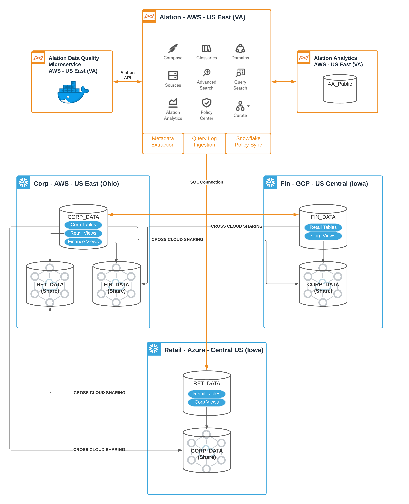

# EDMC_CDMC_Control_Mapping

## The EDMC CDMC Background
This is the code required to build the testbed for proving Snowflake and Alation can be coupled to meet [the CDMC 14 Key Controls for managing sensitive data in the cloud](https://edmcouncil.org/page/cdmc-14-key-controls-and-automation). The CDMC™ (Cloud Data Management Capabilities) Workgroup, part of [the EDM Council](https://edmcouncil.org/page/aboutedmcouncilrevi), introduced the CDMC 14 Key Controls & Automation, as part of the full CDMC v1 Framework. Download the 14 Key Controls document to review the business and regulatory requirements for managing sensitive data in the cloud.

Snowflake and Alation teamed up to be the first to be assessed against these controls, and [proved they have all the required capabilities through an assessment done by KPMG](https://investors.snowflake.com/news/news-details/2021/Snowflake-Achieves-First-Cloud-Data-Management-Capabilities-CDMC-Assessment/default.aspx). 

## How To Use This
If you wished to replicate the testing Snowflake and Alation did to satisfy the 14 Key Controls, this would give you what you need to do so. It can also serve as a reference for how various capabilities were deployed to meet the stated test criteria in the 14 Key Controls. 

To replicate this exactly you would need:
* 3 Snowflake Accounts, ideally in different clouds. Our testing was done with one account each in AWS, Azure, and GCP. (See architecture diagram below)
* An Okta account, or an equivalent IdP to be used for SCIM and SAML
* An instance of Alation 
* This code base
* The Snowflake built in sample data, specifically the TPCDS_SF100TCL data
* Proper authorization in all systems to create objects and integrations from scratch

The test sets up a fictional organization where all the divisions have selected different cloud service providers, but all have agreed on Snowflake as a means to manage and share data in the cloud. 

The design for this testbed is pictured here:

Steps to create the Snowflake parts are as follows:
1. Designate Snowflake accounts as the Corp, Finance, and Retail roles in the fictional organization. 
2. For Corp, run the numbered SQL scripts Corp_01* through Corp_05*. 
3. For Finance, run the numbered SQL scripts Fin_01* through Fin_04*.
4. For Retail, run the numbered SQL scripts Ret_01* through Ret_03*.
5. To make sure there are activities being run against this data, use the SQL provided in the [Corp_06_TPCDS_SF100TCL_Queries](Corp_06_TPCDS_SF100TCL_Queries), [Fin_05_User_Activity_Queries](Fin_05_User_Activity_Queries), and [Ret_04_TPCDS_SF100TCL_Queries](Ret_04_TPCDS_SF100TCL_Queries) directories. There are simple shell scripts included which can be used with cron to run these on a schedule. These could also be run by hand or using any other method that is acceptable in your context. The only requirement is to run them to make sure there is activity that can be traced to the users. 
6. Once the user activity is set up and running, then run the remaining SQL scripts for each of the three accounts. 

At this stage, you are able to move on to the configuration of the Alation instance. 

Steps to create the Alation parts are as follows:
1. If using the Alation instance on-premise, install Alation.  This is not required if using an Alation cloud-managed instance.
2. Request CDMC instance backup file from Alation by mailing john.wills@alation.com.
3. Restore the instance backup file.
4. Switch on Alation Analytics.
5. Copy the data quality test harness python script files (DQ_Driver.py and dq_rules.csv) to the Alation one_off_scripts directory using the Alation shell.
6. Use CRON to schedule DQ_Driver.py to execute once an hour.
7. Copy all policy bot python script files to the Alation one_off_scripts directory using the Alation shell.
8. Use CRON to schedule each policy bot python script file to execute once every 15 minutes.
9. Create an Entitlement Audit Report using a BI tool that queries Alation Analytics and embed the report in the catalog page entitled Entitlement Audit Tracking.
 
